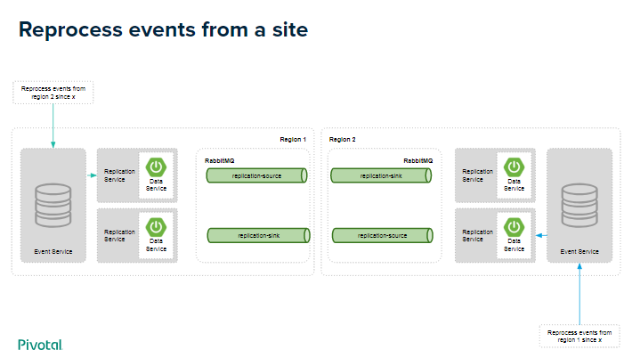

# Replication for Spring Cloud Stream 

Provides an abstraction to replicate event across different sites using Spring Cloud Stream.

## Features

* Auto configured event store for all entities you need to replicate.
* Re-process events with an auto configured endpoint.
* Support for `update` and `delete` operations.

### Replicate and store data events across sites


### Reprocess events from a site



## Getting started

### Dependencies

Add the following dependency to your project

```
      <dependency>
	  <groupId>io.daniellavoie.spring.replication</groupId>
	  <artifactId>spring-boot-replication-starter</artifactId>
	  <version>0.0.1-SNAPSHOT</version>
	</dependency>
```

### Write your first replicated data service
